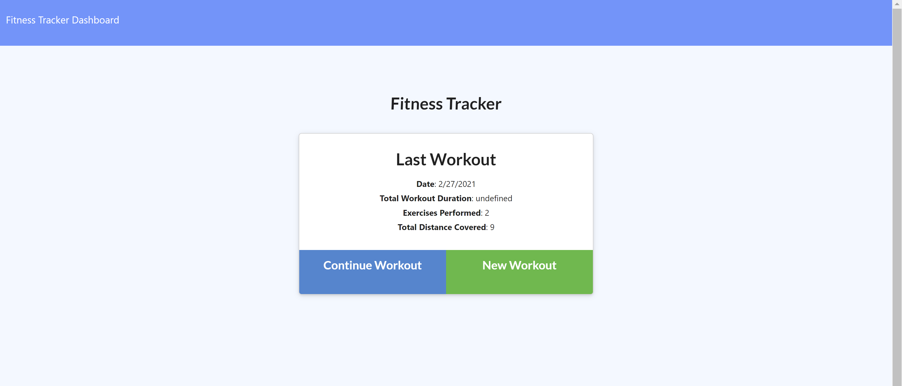

# Workout-Tracker

Project link: [project page](ttps://guarded-gorge-16936.herokuapp.com/)

Github-page: [github-pages](https://github.com/lillianhuynh/Workout-Tracker)

## Table of Contents

* [About the Project](#about-the-project)
  * [Built With](#built-with)
* [Getting Started](#getting-started)
  * [Prerequisites](#prerequisites)
  * [Installation](#installation)
* [Usage](#usage)
* [Roadmap](#roadmap)
* [Contributing](#contributing)
* [License](#license)
* [Contact](#contact)


## About The Project



 A consumer will reach their fitness goals more quickly when they track their workout progress. With Worker-tracker app, user can view, create and track thier daily workouts.


### Built With

* Bootstrap (CSS)
* Node JS
* MongoDB
* Express

## Getting Started

To get a local copy up and running follow these simple steps.

### Installation

1. Clone the repo
```sh
git clone https://github.com/github_username/repo_name.git
```

## Usage

When the user loads the page, they will be given the option to create a new workout or continue with their last workout.

The user will be able to:

  * Add exercises to the most recent workout plan.

  * Add new exercises to a new workout plan.

  * track the name, type, weight, sets, reps, and duration of exercise
  
## Roadmap

See the [open issues](https://github.com/lillianhuynh/Workout-Tracker/issues) for a list of proposed features (and known issues).

## Contributing

Contributions are what make the open source community such an amazing place to be learn, inspire, and create. Any contributions you make are **greatly appreciated**.

1. Fork the Project
2. Create your Feature Branch (`git checkout -b feature/AmazingFeature`)
3. Commit your Changes (`git commit -m 'Add some AmazingFeature'`)
4. Push to the Branch (`git push origin feature/AmazingFeature`)
5. Open a Pull Request

## License

N/A

## Contact

Lili Huynh- lillianhuynh312@gmail.com

Project Link: [ttps://guarded-gorge-16936.herokuapp.com/](ttps://guarded-gorge-16936.herokuapp.com/)